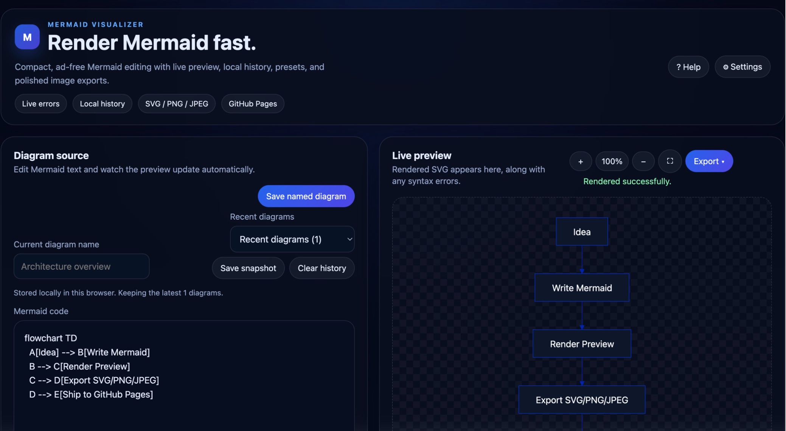

# Mermaid Visualizer

A compact, ad-free [Mermaid](https://mermaid.js.org/) diagram editor with live preview, local history, diagram presets, and polished image exports — hosted on GitHub Pages.

🚀 **[Try it live →](https://jamesmontemagno.github.io/my-mermaid-visualizer/)**

---



## ✨ Features

- **Live preview** — diagrams re-render automatically as you type, with inline error messages
- **Diagram presets** — built-in examples to get started quickly (flowcharts, sequence diagrams, Gantt charts, and more)
- **Local history** — your last 10 diagrams are saved in browser storage so you never lose work
- **Named diagram library** — save, load, and delete up to 25 named diagrams, with import/export to JSON
- **Theme & settings** — choose from multiple Mermaid themes and customize background color, font, and more
- **Export** — download your diagram as **SVG**, **PNG**, or **JPEG** with one click
- **Fullscreen mode** — view and zoom your diagram without distractions
- **Keyboard shortcuts** — common actions are one key-combo away
- **Zero server, zero ads** — entirely client-side, deployed to GitHub Pages

---

## ⌨️ Keyboard Shortcuts

| Shortcut | Action |
|---|---|
| `Ctrl` / `⌘` + `S` | Save current diagram |
| `Ctrl` / `⌘` + `Shift` + `S` | Export as SVG |
| `Ctrl` / `⌘` + `Shift` + `P` | Export as PNG |
| `F11` | Toggle fullscreen view |
| `Esc` | Close open overlay |

---

## 🛠️ Tech Stack

| Tool | Purpose |
|---|---|
| [React 19](https://react.dev/) | UI framework |
| [Vite](https://vitejs.dev/) | Build tool & dev server |
| [Mermaid.js](https://mermaid.js.org/) | Diagram rendering engine |
| [GitHub Pages](https://pages.github.com/) | Hosting (served from `docs/`) |

---

## 🚀 Getting Started

### Prerequisites

- [Node.js](https://nodejs.org/) 18 or later
- npm (bundled with Node.js)

### Development

```bash
# Install dependencies
npm install

# Start the local dev server
npm run dev
```

Open [http://localhost:5173](http://localhost:5173) in your browser.

### Build

```bash
npm run build
```

The production build is written to `docs/` and is what gets deployed to GitHub Pages.

### Lint

```bash
npm run lint
```

---

## 📂 Project Structure

```
my-mermaid-visualizer/
├── src/
│   ├── components/      # React UI components
│   ├── data/            # Presets and theme definitions
│   ├── utils/           # SVG export, storage, colour helpers
│   ├── App.jsx          # Root application component
│   └── main.jsx         # Entry point
├── docs/                # Production build output (GitHub Pages root)
├── index.html           # HTML entry point
└── vite.config.js       # Vite configuration
```

---

## 🤝 Contributing

Contributions are welcome! Feel free to open an issue or submit a pull request.

1. Fork the repository
2. Create your feature branch (`git checkout -b feature/amazing-feature`)
3. Commit your changes (`git commit -m 'Add amazing feature'`)
4. Push to the branch (`git push origin feature/amazing-feature`)
5. Open a Pull Request

---

## 📄 License

This project is open source. See the repository on [GitHub](https://github.com/jamesmontemagno/my-mermaid-visualizer) for details.

---

Built with ❤️ using [GitHub Copilot](https://github.com/features/copilot), [Copilot CLI](https://github.com/features/copilot/cli), and [Visual Studio Code](https://code.visualstudio.com/).
